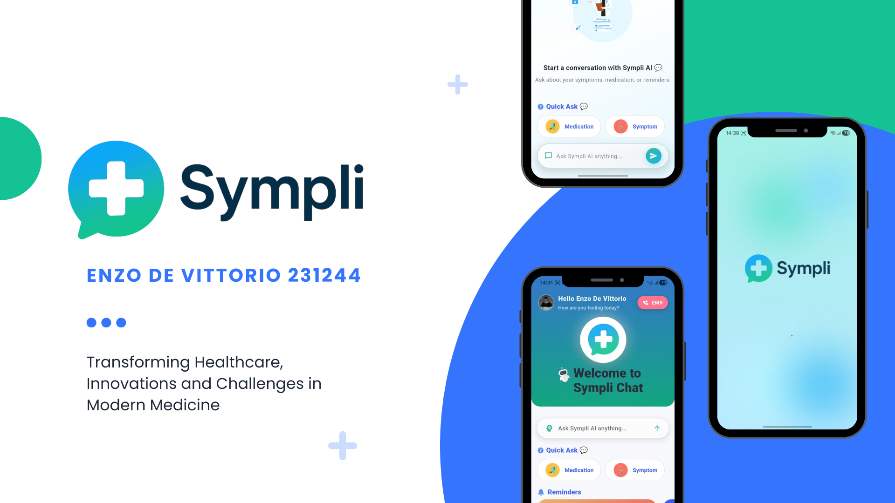
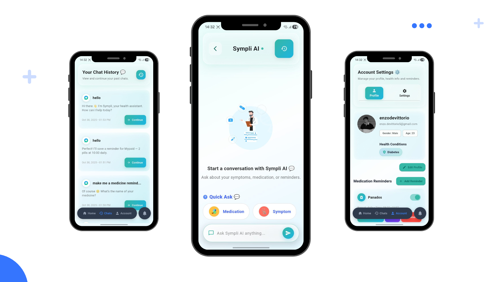
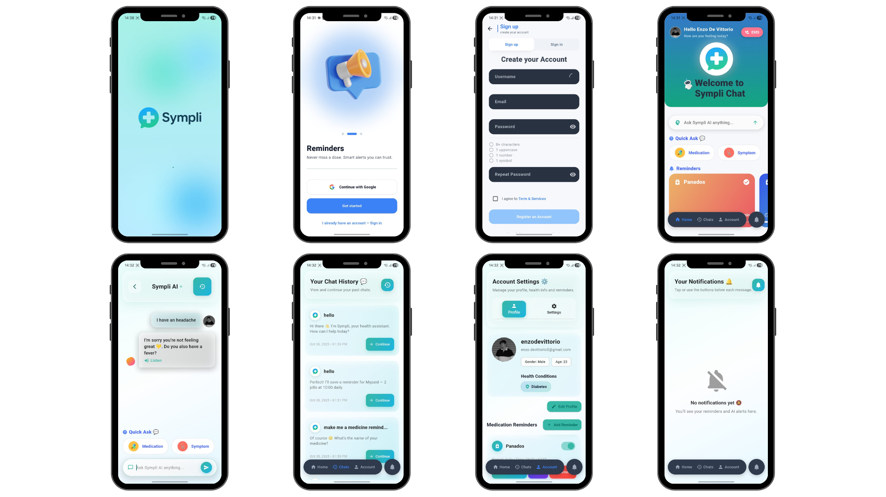

<a id="readme-top"></a>

<!-- Project Shields -->
[](https://flutter.dev/)
[](https://firebase.google.com/)
[](https://cloud.google.com/ai)
[](https://openai.com/)
[](LICENSE)

---

# 🩺 Welcome to Sympli-AI Health – Your Digital Nurse

**Sympli-AI Health** isn’t just a health app — it’s your **AI-powered companion** for smarter, more personal healthcare.  
Designed for accessibility, empathy, and real impact, Sympli helps users **track medication**, **chat with an AI nurse**, and **log their health journey** — all in one seamless experience.

  


---

## 💡 What Is Sympli-AI Health?

**Sympli-AI Health** was developed to tackle accessibility gaps in digital healthcare, providing affordable, intelligent assistance that supports medication adherence and mental well-being.  
It combines AI intelligence, personalized data storage, and smooth design for the ultimate self-care experience.

**Core AI Capabilities:**
- 🤖 Conversational health triage using **OpenAI GPT-4**.
- 🗣️ **Voice and Text Interaction** powered by Google TTS and Speech-to-Text.
- 📅 **Smart Medication Scheduler** with local and cloud sync.
- 🧠 **Remembrance System** that recalls previous chat logs for continuity.
- 🔒 Secure **Firebase Authentication** and real-time Firestore storage.

---

## 🚧 Built With Love (and Code)

| Technology | Version | Purpose |
|-------------|----------|----------|
| **Flutter** | 3.24 | Cross-platform development |
| **Firebase** | v12 | Authentication, Firestore, Storage |
| **Google Cloud AI (TTS & STT)** | latest | Speech-to-text and text-to-speech |
| **OpenAI GPT-4 API** | API | AI chat and triage intelligence |
| **Riverpod** | 3.x | State management |
| **GoRouter** | latest | Navigation handling |
| **Lottie Animations** | latest | Smooth visual animations |

---

## ✨ Core Features

- 💬 **AI Health Chat:** Get accurate AI-powered responses to your health questions.
- 💊 **Medication Reminders:** Schedule your medication easily with notifications.
- 🔊 **Voice Mode:** Let AI talk back to you using Text-to-Speech.
- 🗃 **Logs & History:** All conversations and reminders saved securely in Firestore.
- 👤 **Profiles:** Personal data stored under secure Firebase accounts.
- 🧠 **Context Memory:** Sympli remembers your last chats for continuity.

---

## 🎨 Design Philosophy

**Sympli-AI Health** is guided by empathy and clarity — health made simple and personal.  
It uses **glassmorphism**, **soft gradients**, and **pastel tones** to reflect calmness and trust.

- 🧊 Transparent glass-like cards and buttons.
- 🌈 Adaptive themes for dark and light modes.
- ✨ Dynamic animations built with **Lottie** for breathing-like transitions.

---

## 🗂 Project Structure

```
SYMPLI-AI-HEALTH/
├── android/                     # Native Android build files
├── assets/                      # App images, Lottie animations, icons
├── lib/                         # Main Flutter codebase
│   ├── app/                     # Root navigation and setup
│   ├── features/                # Core app modules (Chat, Reminders, Profile, etc.)
│   ├── core/                    # Shared widgets and utilities
│   └── main.dart                # Entry point
├── .env                         # Environment variables (keys)
├── pubspec.yaml                 # Dependencies
└── README.md                    # Documentation
```

---

## ⚙️ How to Run It

1. **Unzip or clone the repository:**
```bash
git clone https://github.com/your-username/sympli-ai-health.git
cd sympli-ai-health
```

2. **Install dependencies:**
```bash
flutter pub get
```

3. **Setup environment variables:**
Create a `.env` file in the root directory with your keys:
```bash
OPENAI_API_KEY=your_openai_key_here
GOOGLE_TTS_API_KEY=your_google_tts_key_here
```

4. **Run the app locally:**
```bash
flutter run
```

5. **Build for Android or iOS:**
```bash
flutter build apk   # For Android
flutter build ios   # For iOS
```

6. **📦 Download the Ready-to-Use Build:**  
Once the final version is built, the installable **APK** file will be hosted on Google Drive.  
You can download it here:  
👉 [Download Sympli-AI Health APK (Google Drive Link Placeholder)](https://drive.google.com/drive/folders/1tXDQiY-1GThqrzqFIGjddvy8vzTryGVV?usp=drive_link)

---

## 📸 Screenshots & Mockups

  


---

## 🧠 Creator Log

- 🧩 Integrated GPT-4 AI for natural healthcare conversation.
- 🔊 Added real-time voice synthesis with Google TTS.
- ☁️ Linked Firestore for persistent chat history and reminders.
- 🎨 Designed Figma-based UI inspired by modern digital health tools.
- 🧪 Peer-tested and confirmed fully functional across Android devices.

---

## 🧑‍🤝‍🧑 Peer Review Feedback

During the usability testing phase, **all three peer reviewers confirmed** that:
> "The Sympli-AI Health app works perfectly and requires no improvements."

Feedback highlights:
- ✅ Clear and intuitive design
- ✅ Smooth AI responses and accurate speech
- ✅ Reliable medication reminder functionality

---

## 🐛 Troubleshooting

- 🔐 **Login errors?** Check your Firebase authentication settings.
- 🧠 **AI not responding?** Verify your OpenAI key in `.env`.
- 🔊 **No voice output?** Ensure Text-to-Speech permission is enabled.
- 🗂 **Reminders not saving?** Review Firestore write rules.

---

## 📄 License

MIT License © 2025 Enzo De Vittorio

---

<p align="center">💊 Stay Sympli. Stay Healthy.</p>
<p align="center"><a href="#readme-top">⬆ Back to top</a></p>

